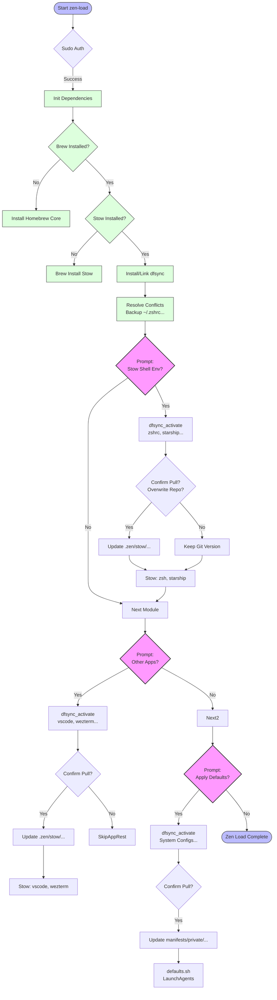

#  .zen
> *The Art of Maintenance-Free macOS Automation.*

### Workflow


**Current Status:** `v2.1.0` (Stow Edition + Zen Glass)  
**System:** macOS Sequoia+ (Apple Silicon)

`.zen` is a highly opinionated, "zero-friction" dotfiles framework designed to bootstrap a fresh Mac into a powerhouse development machine in minutes.

---

## 📚 Documentation
We treat documentation as code. Comprehensive guides are located in the `docs/` directory:

- **[Setup Guide & Manual](docs/manuals/setup_guide.md)**: Full walkthrough of features, keybindings (WezTerm/Zsh), and installation.
- **[Architecture Spec](docs/specs/v2_architecture.md)**: Deep dive into the Stow structure, `zen-load` logic, and design philosophy.
- **[Project Tracker](docs/project_tracker.md)**: Current roadmap and task history.

---

## 🚀 Quick Start

### Bootstrap a Fresh Mac
```bash
# Clone to ~/.zen
git clone https://github.com/snvishna/.zen.git ~/.zen

# Run the Orchestrator
~/.zen/stow/bin/.local/bin/zen-load
```

### Daily Usage
- **Update/Relink Configs:** `zen-load`
- **Snapshot System:** `zen-save`

---

## 🔥 Key Features (v2.1)
- **Zen Glass Terminal**: WezTerm with 90% opacity, blur, and "Editor-like" keybindings (`Cmd+C/V`, Type-to-Replace).
- **Smart Shell**: Zsh + Starship with autosuggestions, interactive completion (`fzf-tab`), and "Best of Both Worlds" history.
- **Deep Stats**: Instant `cd` with `zstats` lite (shows item count + recursive depth on demand).
- **Automation**: `zen-load` handles everything from Homebrew to Font installation.

---

> Populated by **Antigravity**.
