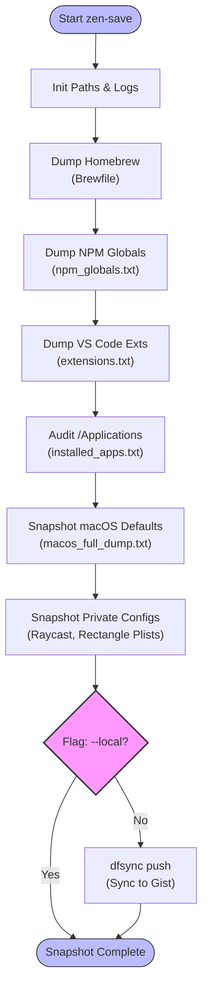

#  .zen
> *The Art of Maintenance-Free macOS Automation.*

  

**.zen** is an opinionated, privacy-first dotfiles framework designed to bootstrap a fresh Mac into a powerhouse development machine in minutes. It separates **Public Configuration** (this repo) from **Private State** (your Gist), giving you the best of open-source sharing and secure personal backup.

---

## ⚡️ The Workflow
How does `zen-load` orchestrate your setup? Here is the decision tree it follows:


---

## 🌟 Why .zen?

### 1. Zero Friction, Full Control
Unlike massive Ansible playbooks or opaque scripts, `.zen` uses **GNU Stow**. Your config files live in `~/.zen/stow/` and are symlinked to their target locations.
*   **Want to change a config?** Edit it properly in `~/.zen`.
*   **Want to remove a package?** `stow -D package`.
*   **Conflict?** `zen-load` automatically detects and backs up existing files before linking.

### 2. Hybrid Cloud Sync (dfsync)
Most dotfiles repos expose your secrets or force you to use a separate private repo.
**.zen** uses a hybrid approach:
*   **Public Repo**: Contains templates, scripts, generic configs (`.zshrc`, `wezterm.lua`).
*   **Private Gist**: Contains **YOUR** specific overrides and secrets (API keys, private env vars).
*   **The Magic**: `zen-load` intelligently merges them. It pulls your private state from Gist (via `dfsync`) *over* the public templates, then symlinks the result.

### 3. Private Overrides (The Secret Sauce) 🔐
Need to store API keys or work-specific aliases that shouldn't be in the public repo?
.zen checks for optional **Private Overrides** that are ignored by git but synced by dfsync:
*   **Shell**: `~/.zshrc.local` (Sourced automatically by .zshrc)
*   **WezTerm**: `~/.config/wezterm/wezterm-private.lua` (Merged automatically)
*   **Git**: `~/.gitconfig.local`

Just create these files, and `zen-save` will back them up to your private Gist!

### 4. Modular & Interactive
`zen-load` is not "all-or-nothing". It asks you what you want to install:
*   📦 **Shell Engine**: Zsh, Starship, Git, Binaries.
*   💻 **Terminal**: WezTerm (GPU-accelerated, Lua-configured).
*   📝 **Editor**: VS Code (Settings, Keybindings, Extensions).
*   🍎 **System**: macOS Defaults, Dock layout, Finder tweaks.

---

## 🚀 Quick Start

### 1. Clone & Bootstrap
```bash
git clone https://github.com/snvishna/.zen.git ~/.zen
~/.zen/stow/bin/.local/bin/zen-load
```

### 2. The Setup Wizard
`zen-load` will launch an interactive wizard:
1.  **Dependencies**: Automatically installs Homebrew and Stow if missing.
2.  **dFsync**: Downloads the latest cloud sync tool.
3.  **Restore**: Asks for your Gist ID (optional).
    *   *New User?* Leave blank. A new Gist will be created when you first push.
    *   *Existing User?* Enter ID. It will pull your private configs.
4.  **Modules**: Prompt-by-prompt installation of Shell, Terminal, Editor, and System tweaks.

### 3. Daily Workflow
#### Restoration (zen-load)
*   **New machine?** Run `zen-load` to restore environment.

#### Snapshot (zen-save)
*   **Made changes?** Run `zen-save` to snapshot state.



---

## 🔥 Features Under the Hood

| Feature | Description |
| :--- | :--- |
| **Zen Glass** | Custom WezTerm config with 90% opacity, blur, and "Editor-like" bindings (`Cmd+C/V`). |
| **Smart Shell** | Zsh + Starship with autosuggestions, `fzf-tab` completion, and localized history. |
| **Auto-Heal** | `zen-save` automatically snapshots your installed apps (`Brewfile`, `installed_apps.txt`) and macOS defaults. |
| **Conflict-Free** | Robust conflict resolution moves old config files to `~/.zen/graveyard/` instead of breaking. |
| **Rolling Release** | `zen-load` always fetches the latest stable `dfsync` binary to ensure compatibility. |

---

## 📂 Documentation
*   **[Setup Guide](docs/manuals/setup_guide.md)**: Detailed installation & customization.
*   **[Architecture](docs/specs/v2_architecture.md)**: Deep dive into Stow & Symlinks.
*   **[Tracker](docs/project_tracker.md)**: Roadmap & Changelog.

> *Maintained by the .zen team.*
